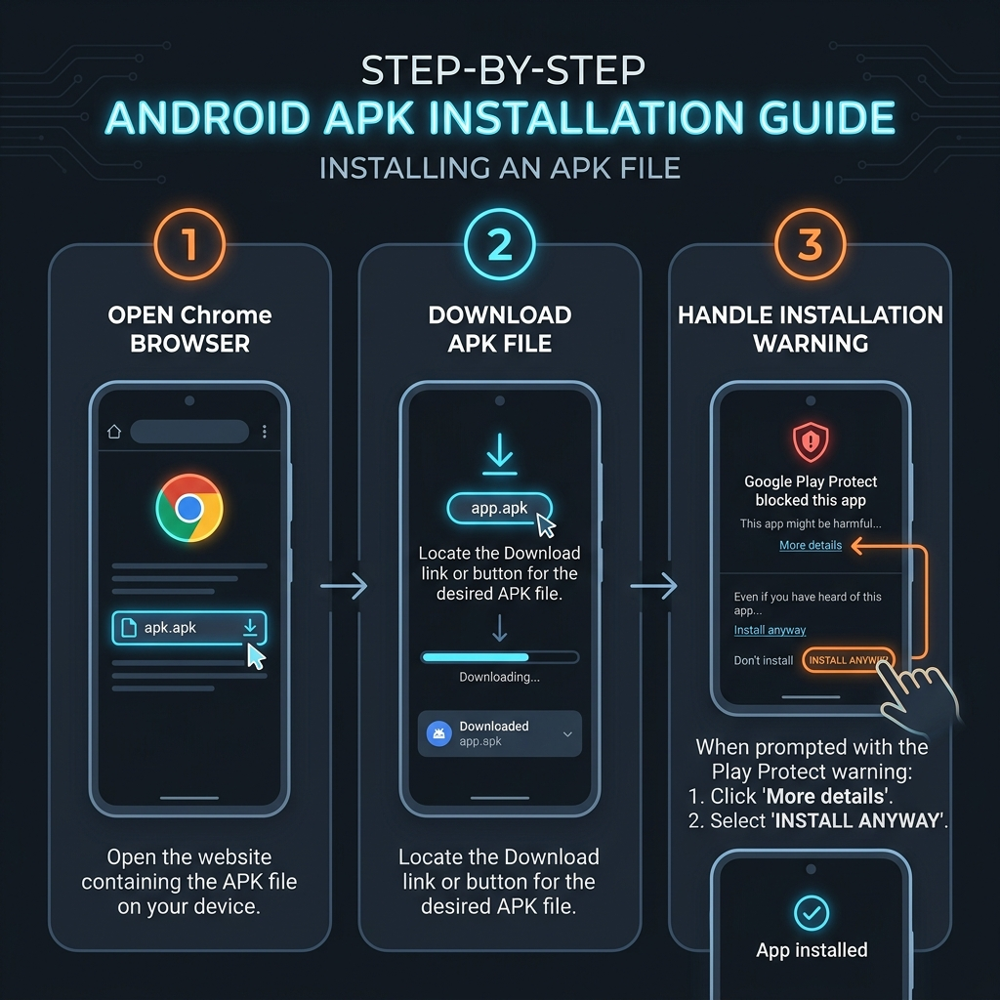

# Analog Anchor Offline Challenge

---

## 🇸🇦 دليل التنزيل والتثبيت باللغة العربية (Arabic Version)

### 📥 تنزيل التطبيق مباشرة
اضغط على الزر أدناه لتنزيل ملف الـ APK مباشرة لجهازك الأندرويد:

*إذا لم يبدأ التحميل التلقائي، يمكنك الضغط [هنا لتنزيل التطبيق مباشرة](https://github.com/arazi-hash/Analog-Anchor-Offline-Challenge/releases/download/latest/offline.apk).*

---

### 🛠️ خطوات التثبيت وتخطي الحظر (شرح خطوة بخطوة)

لتفادي مشاكل الحظر والتثبيت، يُرجى اتباع الخطوات التالية بدقة:

#### 1️⃣ افتح الرابط في متصفح Google Chrome
إذا قمت بفتح هذا الرابط من داخل تطبيق واتساب (WhatsApp)، قم بنسخ الرابط (`https://github.com/arazi-hash/Analog-Anchor-Offline-Challenge`) وافتحه يدوياً في متصفح **Google Chrome** على هاتفك. التنزيل من داخل متصفح واتساب المدمج يواجه قيوداً تمنع التثبيت.

#### 2️⃣ اسمح بالتثبيت من مصادر غير معروفة
عند تحميل الملف ومحاولة فتحه، قد يطلب منك الهاتف الانتقال إلى **الإعدادات (Settings)** لتفعيل خيار **"السماح بتثبيت التطبيقات من هذا المصدر" (Allow from this source)** لمتصفح كروم. قم بتفعيل الخيار ثم ارجع للتثبيت.

#### 3️⃣ تخطي حماية Google Play Protect
بما أن التطبيق جديد ومفتوح المصدر ولم يتم رفعه على متجر Google Play بعد، ستظهر لك رسالة حظر زرقاء من نظام الحماية (كما هو موضح في الدليل البصري أدناه):
* اضغط على **"مزيد من التفاصيل" (More details)** أو السهم الصغير المتجه للأسفل.
* اضغط على زر **"التثبيت على أي حال" (Install anyway)** لإتمام التثبيت بنجاح.

---

### 📊 الدليل الإرشادي البصري (Arabic Infographic)

---
---

## 🇬🇧 Download & Installation Guide (English Version)

### 📥 Direct APK Download
Click the banner below to download the APK file directly to your Android device:

*If the download does not start automatically, you can click [here to download directly](https://github.com/arazi-hash/Analog-Anchor-Offline-Challenge/releases/download/latest/offline.apk).*

---

### 🛠️ Step-by-Step Installation Guide

To ensure a smooth installation without blocks, please follow these steps:

#### 1️⃣ Open this Page in Google Chrome
If you opened this link from inside WhatsApp, copy the URL (`https://github.com/arazi-hash/Analog-Anchor-Offline-Challenge`) and open it in the **Google Chrome** app. Installing directly from WhatsApp's built-in browser is blocked by system security.

#### 2️⃣ Allow Installation from Unknown Sources
When opening the downloaded APK, your phone may ask you to go to **Settings** and enable **"Allow from this source"** for Google Chrome. Turn this switch on, then go back to resume.

#### 3️⃣ Bypass Google Play Protect Warning
Because this is a custom open-source application and has not been published to the Google Play Store, Play Protect will display a warning block screen:
* Tap **"More details"** (or the small dropdown arrow).
* Tap **"Install anyway"** to complete the installation.

---

### 📊 Visual Installation Guide (English Infographic)

