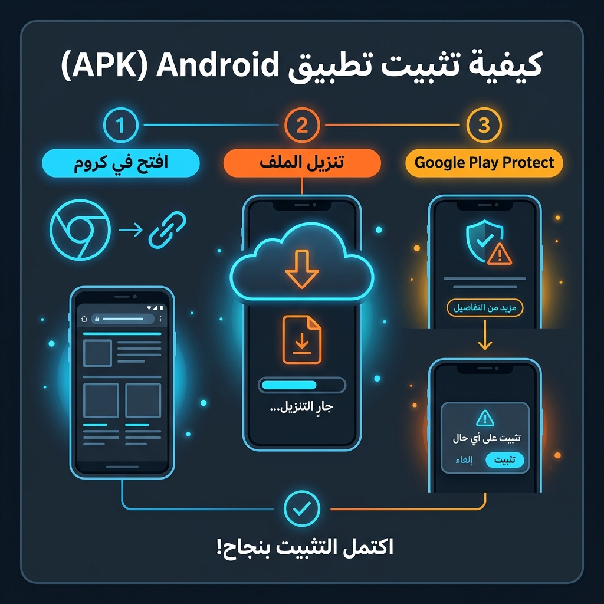
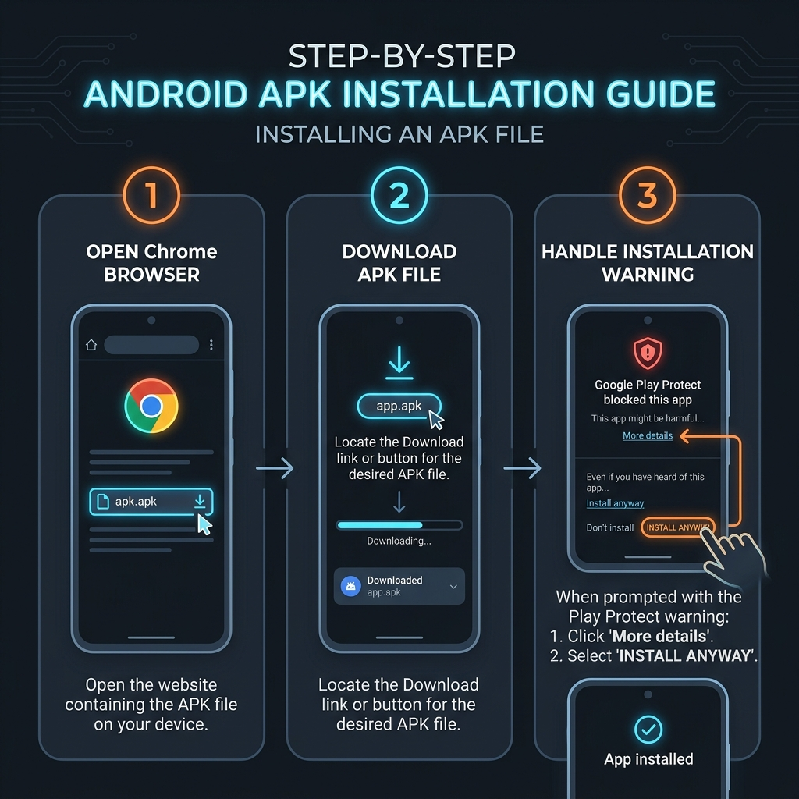

# Analog Anchor Offline Challenge

---

## 🇸🇦 دليل التنزيل والتثبيت باللغة العربية (Arabic Version)

### 🛡️ أمان التطبيق ومصداقيته (كود مفتوح المصدر)
هذا التطبيق آمن تماماً ومفتوح المصدر بالكامل (Open-Source). يمكنك أنت أو أي مبرمج مراجعة الكود البرمجي هنا للتأكد من خلوه من أي برمجيات ضارة وضمان حماية خصوصيتك وبياناتك 100%. تم تطوير هذا الإصدار خصيصاً لأغراض **تحدي الأوفلاين (Offline Challenge)**.

💡 **هل تريد حلاً تجارياً متكاملاً؟**
إذا واجهتك مشاكل في الاتصال بالإنترنت وتحتاج إلى حل احترافي، يمكنك الانتقال إلى تطبيقنا التجاري الأساسي **Analog Anchor** (المعروف بـ **Nightguard**). تم تصميم التطبيق التجاري استناداً إلى فلسفة **التصميم السلوكي المتراكم (Accumulated Behavioral Design)** لمساعدتك على التحكم في سلوكك الرقمي وحمايتك بالكامل. ويشمل ميزات متقدمة مثل:
* **قفل الفجر (Fajr Lock):** لحمايتك وتنظيم استخدامك خلال فترة الصباح الباكر.
* **بروتوكول المحو (Eraser Protocol):** لإخفاء وحذف البيانات الحساسة فوراً وبأمان.
* **توقف التنفس (Breathing Interruption):** آلية ذكية تراقب وتنبهك من خلال مؤقت يظهر بعد 25 ثانية من الاستخدام المتواصل (Overlay timer).
* **مفهوم محميات الـ GPS (GPS Sanctuary concepts):** لتحديد مناطق جغرافية آمنة يُمنع فيها استخدام التطبيقات المشتتة.
* **الاحتكاك الخفي (Hidden friction):** إدخال عقبات بسيطة ومدروسة سلوكياً لإبطاء ومنع الاستخدام اللاوعي للهاتف.
* **فلسفة تهيئة الـ NFC (NFC onboarding philosophy):** إعداد وتفعيل سلس وسريع باستخدام ملصقات وبطاقات NFC المادية لضمان الالتزام الفعلي.

---

### 📥 تنزيل التطبيق مباشرة
اضغط على الزر أدناه لتنزيل ملف الـ APK مباشرة لجهازك الأندرويد:

*إذا لم يبدأ التحميل التلقائي، يمكنك الضغط [هنا لتنزيل التطبيق مباشرة](https://github.com/arazi-hash/Analog-Anchor-Offline-Challenge/releases/download/latest/offline.apk).*

---

### 🛠️ خطوات التثبيت وتخطي الحظر (شرح خطوة بخطوة)

لتفادي مشاكل الحظر والتثبيت، يُرجى اتباع الخطوات التالية بدقة:

#### 1️⃣ افتح الرابط في متصفح Google Chrome
إذا قمت بفتح هذا الرابط من داخل تطبيق واتساب (WhatsApp)، قم بنسخ الرابط (`https://github.com/arazi-hash/Analog-Anchor-Offline-Challenge`) وافتحه يدوياً في متصفح **Google Chrome** على هاتفك. التنزيل من داخل متصفح واتساب المدمج يواجه قيوداً تمنع التثبيت.

#### 2️⃣ اسمح بالتثبيت من مصادر غير معروفة
عند تحميل الملف ومحاولة فتحه، قد يطلب منك الهاتف الانتقال إلى **الإعدادات (Settings)** لتفعيل خيار **"السماح بتثبيت التطبيقات من هذا المصدر" (Allow from this source)** لمتصفح كروم. قم بتفعيل الخيار ثم ارجع للتثبيت.

#### 4️⃣ نظام حماية إعادة التشغيل والمعايرة الذكية (Reboot & Decoy Defense)
تم تزويد التطبيق بنظام أمان متعدد الطبقات لضمان عدم تخطي الحظر عبر إعادة تشغيل الهاتف:
* **تفعيل الدفاع التلقائي (Background Defense):** يتيح إعداد خطوة واحدة لتفعيل خيار التشغيل التلقائي في الخلفية لح هواتف (Xiaomi / Redmi / Samsung / Huawei / Oppo / Vivo).
* **إعادة التشغيل التلقائي والتنبيه الفوري:** عند إعادة تشغيل الهاتف أثناء التحدي النشط، يقوم التطبيق بفتح شاشة المعايرة تلقائياً أو إرسال تنبيه عالي الأولوية (Alarm/Call Style) لا يمكن تغافله.
* **شاشة المعايرة المموهة (Decoy Calibration Screen):** في حال توقف الدرع بسبب قيود النظام، تُعرض شاشة تمويه تُطالب المستخدم بتفعيل "التغطية الدائمة" في إعدادات النظام، مما يوجهه لتفعيل (Always-On VPN) الذي يحظر الإنترنت بالكامل على مستوى نظام الأندرويد.

---

### 📊 الدليل الإرشادي البصري (Arabic Infographic)

---
---

## 🇬🇧 Download & Installation Guide (English Version)

### 🛡️ Security & Transparency (Open-Source Code)
This project is 100% open-source, allowing you or any developer to inspect the entire codebase to guarantee complete safety, privacy, and zero malware. This specific version is built for the **Offline Challenge** demonstration.

💡 **Looking for a Commercial Offline Solution?**
If you need reliable operations and a comprehensive solution, check out our flagship commercial application: **Analog Anchor** (also known as **Nightguard**). It is built with an extensive suite of **Accumulated Behavioral Design** mechanics to help you regain digital sovereignty. Key features include:
* **Fajr Lock:** Restricts device usage during critical early morning hours.
* **Eraser Protocol:** A secure, instant-wipe system for sensitive data.
* **Breathing Interruption:** Triggered after 25 seconds of continuous focus/usage, bringing up a smart overlay timer to break subconscious scrolling/usage.
* **GPS Sanctuary Concepts:** Set physical geofenced safe zones where distracting features are locked.
* **Hidden Friction:** Intentionally designed micro-barriers that break compulsive digital habits.
* **NFC Onboarding Philosophy:** Seamless hardware-bound setup and validation using physical NFC tags to enforce physical presence and commitment.

---

### 📥 Direct APK Download
Click the banner below to download the APK file directly to your Android device:

*If the download does not start automatically, you can click [here to download directly](https://github.com/arazi-hash/Analog-Anchor-Offline-Challenge/releases/download/latest/offline.apk).*

---

### 🛠️ Step-by-Step Installation Guide

To ensure a smooth installation without blocks, please follow these steps:

#### 1️⃣ Open this Page in Google Chrome
If you opened this link from inside WhatsApp, copy the URL (`https://github.com/arazi-hash/Analog-Anchor-Offline-Challenge`) and open it in the **Google Chrome** app. Installing directly from WhatsApp's built-in browser is blocked by system security.

#### 2️⃣ Allow Installation from Unknown Sources
When opening the downloaded APK, your phone may ask you to go to **Settings** and enable **"Allow from this source"** for Google Chrome. Turn this switch on, then go back to resume.

#### 4️⃣ Multi-Layer Reboot & Decoy Defense System
The app features an advanced anti-bypass security system preventing users from breaking the offline lock via device reboots:
* **Background Defense Setup:** 1-tap setup guiding users to enable OEM autostart / background management (Xiaomi / Redmi / Samsung / Huawei / Oppo / Vivo).
* **Automatic Screen Launch & Heads-Up Alerts:** Upon device restart during an active challenge, `BootReceiver` automatically force-launches the calibration screen and triggers a high-priority Heads-Up Notification (alarm/call style) over any active app.
* **Decoy Calibration Protocol:** If the shield drops due to OS restrictions, the app displays a seamless "Shield Synchronization Lost" decoy dialog directing the user to enable System Always-On VPN protection.

---

### 📊 Visual Installation Guide (English Infographic)

